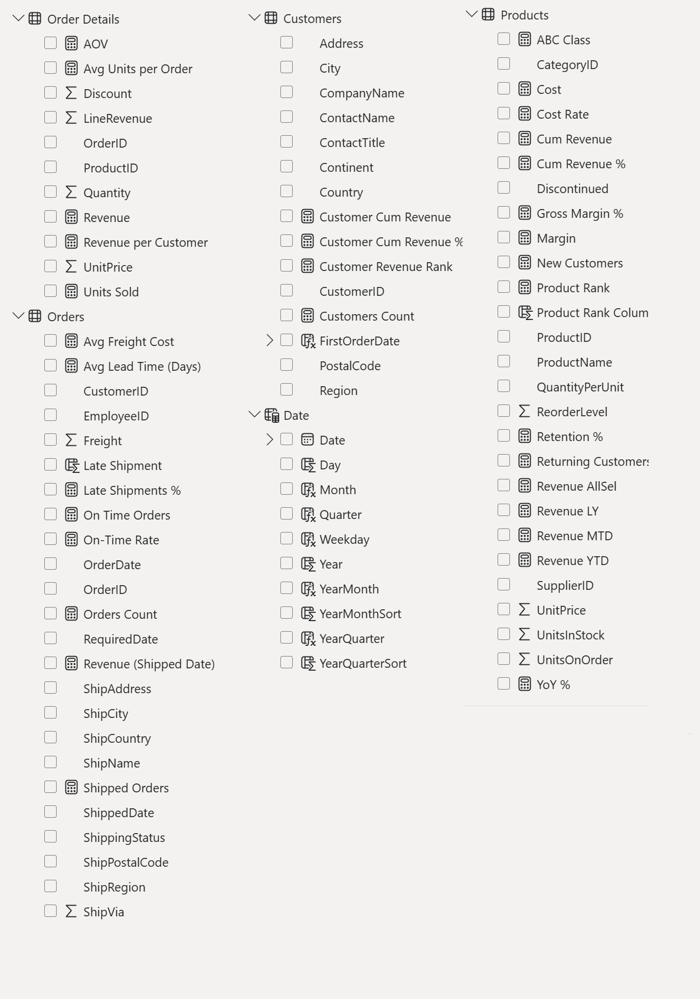
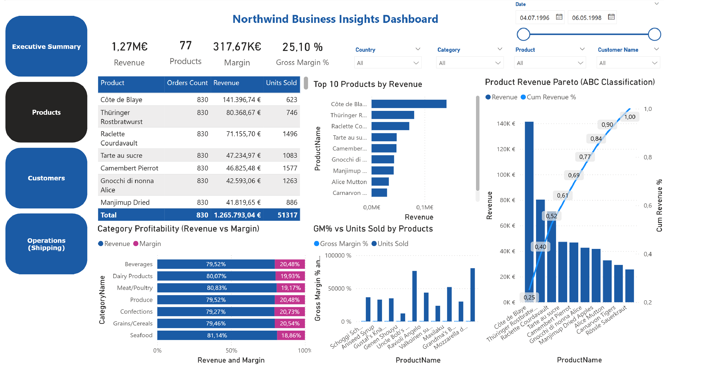
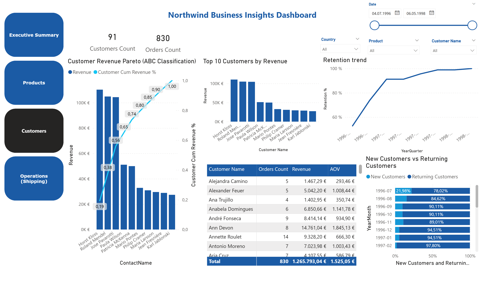
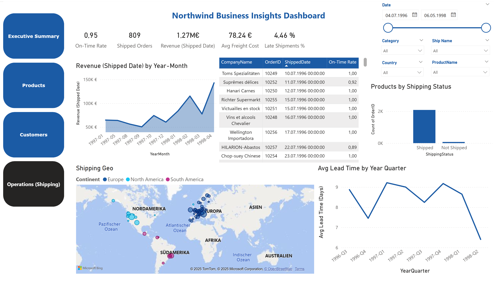

# Northwind Business: End‑to‑End Analytics in Power BI (SQL Server → Power Query → DAX)

  

**TL;DR** — Recreate a production‑style analytics stack on the classic **Northwind** dataset: pull from **SQL Server**, transform in **Power Query**, model relationships and **DAX** measures, and deliver a **Power BI** dashboard with executive KPIs, Product & Customer Pareto (ABC), and Shipping performance (lead time, on‑time rate, late shipments).

**Tech**: SQL Server • Power Query (M) • Power BI / DAX  
**Data**: Microsoft **Northwind** sample database (Orders 1996‑1998)  
**Repo map**: [`sql/`](sql) • [`powerbi/`](powerbi) • [`assets/`](assets)

---

## Table of Contents
- [Background](#background)
- [Business Questions](#business-questions)
- [Dataset](#dataset)
- [Data Model](#data-model)
- [Methodology](#methodology)
- [Key DAX Measures](#key-dax-measures)
- [Dashboard Pages](#dashboard-pages)
- [Key Findings](#key-findings)
- [How to Reproduce](#how-to-reproduce)
- [Deliverables](#deliverables)
- [Business Recommendations](#business-recommendations)

---

## Background
This project demonstrates a **business‑ready analytics workflow** on a well‑known retail/wholesale dataset. It’s designed as a reference for:
- Building **clean star‑schema models** (Date, Products, Customers as dimensions; Orders/Order Details as facts).
- Translating stakeholder questions into **DAX KPIs** that are easy to explain and maintain.
- Packaging a **Power BI** report that mirrors real executive and functional dashboards.

---

## Business Questions
1. **Executive:** What are Revenue, Margin, and Gross Margin % over time? What’s the **AOV** and how many **orders/customers** drive our revenue?  
2. **Products:** Which products/categories generate the **top 80–95%** of revenue (Pareto/ABC)? Which items have strong **GM%** vs. **Units Sold**?  
3. **Customers:** Who are our **top customers**, how does **retention** trend, and how many **new vs. returning** customers do we see by month?  
4. **Operations (Shipping):** What is our **on‑time rate**, **late shipments %**, **average lead time (days)**, and how does shipped revenue trend by month/country?

---

## Dataset
- **Source:** Microsoft **Northwind** sample (SQL Server).  
- **Grain:** Order line (Order Details) with pricing and discount; Orders table holds dates, freight & ship info.  
- **Time range:** 1996–1998 (per Northwind).  
- **Entities used:** `Customers`, `Orders`, `Order Details`, `Products`, `Categories`, `Shippers`, `Suppliers`, `Date`.  
- **Assumptions table:** `Assumptions` contains a **CostRate** parameter (e.g., 0.75) and scenario label; used to simulate cost/margin.

> _Note:_ Northwind does not include product cost; a **CostRate** parameter is used to approximate cost from revenue for margin analysis. You can tune this per scenario.

---

## Data Model

  

- **Relationships**
  - `Customers (1) ── (∞) Orders`
  - `Orders (1) ── (∞) Order Details`
  - `Products (1) ── (∞) Order Details`
  - `Categories (1) ── (∞) Products`
  - `Date (1) ── (∞) Orders[OrderDate]` (active)  
  - `Date (1) ── (∞) Orders[ShippedDate]` (inactive; activated in measures for ship‑date analysis)

- **Dimensions**  
  `Date` includes Date, Day, Month, Quarter, Year, YearMonth, Weekday, with sort columns for proper chronological visuals.

---

## Methodology

### 1) SQL Server (source)
- Restore/install **Northwind** on your local SQL Server (Express/Developer).  

  

### 2) Power Query (ETL)
- **Standardization:** `Trim/Clean`, type conversions, consistent casing for text.
- **Derived columns (examples):**
  - **Order Details**: `LineRevenue = UnitPrice * Quantity * (1 - Discount)`  
  - **Orders**: `ShippingStatus = if ShippedDate = null then "Not Shipped" else "Shipped"`  
  - **Orders**: `Late Shipment = ShippedDate > RequiredDate` (boolean)  
  - **Orders**: `LeadTimeDays = DATEDIFF(OrderDate, ShippedDate)` for shipped rows only  
  - **Customers**: added a custom **Continent** column to group countries into broader geographic zones for mapping and slicers  
- **Assumptions:** load a tiny table `Assumptions[CostRate, Scenario]` for what-if margin analysis.
- **Data quality:** removed obvious nulls/duplicates where appropriate.

  

### 3) Modeling (Power BI)
- Built `Date` via `CALENDAR(MIN(Orders[OrderDate]), MAX(Orders[OrderDate]))` + time attributes.
- Star schema with one‑to‑many relationships as above; marked `Date` as **Date table**.
- Created inactive relation to `Orders[ShippedDate]` for operational KPIs.

  

  

### 4) Measures (DAX)

The report relies on carefully structured, reusable DAX measures organized by analytical layer:

#### **Base KPIs**
- **Revenue** — total line revenue (`UnitPrice * Quantity * (1 - Discount)`)
- **Orders Count** — unique count of orders  
- **Customers Count** — unique count of customers  
- **AOV** — average order value (`Revenue ÷ Orders`)  

#### **Profitability**
- **Scenario-driven Cost** using parameterized `CostRate` from the *Assumptions* table  
- **Margin** = `Revenue – Cost`  
- **Gross Margin %** = `Margin ÷ Revenue`  

#### **Operational KPIs**
- **Shipped Orders**, **On-Time Orders**, and **On-Time Rate**  
- **Late Shipments %** = `1 – On-Time Rate`  
- **Avg Lead Time (Days)** = average days between `OrderDate` and `ShippedDate`  

#### **Time Intelligence**
- **Revenue LY**, **YoY%**, **Revenue MTD**, **Revenue YTD**  

#### **Pareto / ABC Classification**
- **Product Rank**, **Cumulative Revenue %**, and **ABC Class** (A/B/C based on 80–95–100% cumulative thresholds)  

#### **Customer Segmentation**
- **New Customers**, **Returning Customers**, and **Retention KPIs** based on `FirstOrderDate`  

These measures drive all visuals across **Executive**, **Product**, **Customer**, and **Operations** dashboards.

---

## Dashboard Pages

  
  
  
  

- **Executive Summary** — KPIs (Revenue, Margin, GM%), AOV, Orders & Customers; YoY trend; Product Pareto; Category revenue; Country map; Cost vs. Revenue donut.
- **Products** — Top products, Product Pareto with **ABC**, Category profitability (Revenue vs Margin), GM% vs Units Sold.
- **Customers** — Top 10 customers; **Retention trend**; New vs Returning by month; revenue distribution (customer Pareto).
- **Operations (Shipping)** — On‑Time Rate, Late Shipments %, Avg Freight Cost, **Revenue (Shipped Date)** by Year‑Month, Shipping status, Geo, **Avg Lead Time** by quarter.

---

## Key Findings
*(from the packaged PBIX using the Northwind sample)*

- **Executive KPIs:** ~**€1.27M** Revenue, **€317.7K** Margin, **25.1%** GM%, **€1.53K** AOV, **830** Orders, **91** Customers.
- **Product Mix:** A small set of SKUs (e.g., _Côte de Blaye_, _Thüringer Rostbratwurst_) drives the bulk of revenue — classic **Pareto 80/20** distribution.
- **Category Profitability:** Categories show healthy margins clustered ~18–20%+, with beverages and dairy among the top revenue contributors.
- **Customers:** Top accounts concentrate revenue; **retention** trends upward over the time series; steady flow of **new vs returning** customers by month.
- **Shipping/Ops:** **~95% on‑time**, **~4.5% late**; **Avg lead time** fluctuates by quarter; most revenue recognized on shipped orders follows seasonality.

> These insights are reproducible on any restored Northwind SQL sample; the dashboard is fully filterable by Date, Country, Category, Product, and Customer.

---

## How to Reproduce

1. **Clone this repo.**  
2. Set up the Northwind database

    Download and restore the Northwind sample from Microsoft’s repository:
    https://github.com/microsoft/sql-server-samples/tree/master/samples/databases/northwind-pubs
   - Open **SQL Server Management Studio (SSMS)** → connect to your **local SQL Server** (e.g., `.\SQLEXPRESS`).  
   - In SSMS, go to **File → Open → File…** → navigate to and open `instnwnd.sql`.  
   - Once the script opens in a new query window, click the **Execute** button (or press **F5**) to run it.  
   - When execution completes, refresh the **Databases** folder in the **Object Explorer** — a new database named **Northwind** will appear. 
   - Expand it to confirm key tables like:
     - `Orders`
     - `Order Details`
     - `Products`
     - `Categories`

4. **Power BI Desktop**
   - Open `powerbi/northwind_business.pbix`.
   - When prompted, set **SQL Server instance** (e.g., `.\SQLEXPRESS`) and database `Northwind`.
   - Refresh. If needed, update credentials in _Transform Data_ → _Data source settings_.
5. **Optional: tweak assumptions**
   - In the **Assumptions** table, change `CostRate` (e.g., 0.70–0.80) to test profitability scenarios.
6. Explore the pages: **Executive**, **Products**, **Customers**, **Operations (Shipping)**.

---

## Deliverables
- **Power BI report:** [Northwind-Business-Dashboard.pbix](./Northwind-Business-Dashboard.pbix)  
- **Screenshots:**  
  - [Executive Summary](./assets/Northwind%20Business-Dashboard-Executive%20Summary.png)  
  - [Products](./assets/products.png)  
  - [Customers](./assets/customers.png)  
  - [Operations](./assets/operations.png)  
  - [SQL Server](./assets/SQL%20Server.png)  
  - [Power Query](./assets/Power%20Query.png)  
  - [Data Model](./assets/Data%20Model.png)  
  - [Measures](./assets/Measures.png)

---

## Business Recommendations

1. **Double‑down on “A” products** (top ~80% of revenue). Maintain stock, optimize pricing, and prioritize promotions for these SKUs.  
2. **Lift GM% on “B/C” products** via pricing tests, bundles, or supplier negotiations; retire persistently low‑margin items.  
3. **Customer strategy:** Build account plans for the top decile customers; run win‑back & referral campaigns for mid‑tier segments.  
4. **Operations:** Track **on‑time** and **lead time** monthly; investigate outlier lanes/regions and carrier performance when late‑shipment % rises.  
5. **Scenario planning:** Use the **CostRate** parameter to stress‑test profit under changing input costs and discounts.

---

