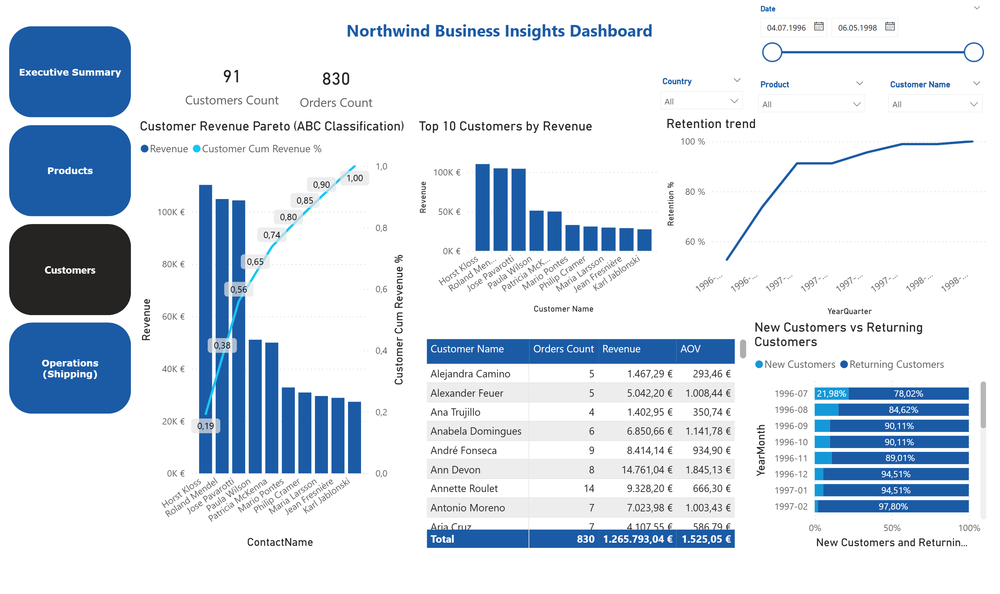
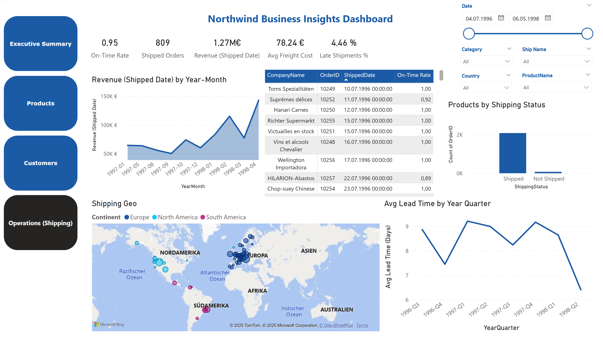

# Northwind Business: End‑to‑End‑Analytics in Power BI (SQL Server → Power Query → DAX)

  

**TL;DR** — Produktionsnahe Analytics-Stack auf dem klassischen **Northwind**‑Datensatz nachbauen: Daten aus **SQL Server** ziehen, in **Power Query** transformieren, Beziehungen und **DAX**‑Measures modellieren und ein **Power BI**‑Dashboard mit Executive‑KPIs, Produkt‑ & Kunden‑Pareto (ABC) sowie Shipping‑Kennzahlen (Lead Time, On‑Time‑Rate, Late Shipments) ausliefern.

**Tech**: SQL Server • Power Query (M) • Power BI / DAX  
**Daten**: Microsoft **Northwind** Sample‑Datenbank (Orders 1996‑1998)  
**Repo‑Struktur**: [`sql/`](sql) • [`powerbi/`](powerbi) • [`assets/`](assets)

---

## Inhaltsverzeichnis
- [Hintergrund](#hintergrund)
- [Geschäftsfragen](#geschäftsfragen)
- [Datensatz](#datensatz)
- [Datenmodell](#datenmodell)
- [Methodik](#methodik)
- [Wichtige DAX‑Maße](#wichtige-dax-mäße)
- [Dashboard‑Seiten](#dashboard-seiten)
- [Zentrale Erkenntnisse](#zentrale-erkenntnisse)
- [So reproduzierst du es](#so-reproduzierst-du-es)
- [Ergebnisse (Deliverables)](#ergebnisse-deliverables)
- [Business‑Empfehlungen](#business-empfehlungen)

---

## Hintergrund
Dieses Projekt demonstriert einen **business‑tauglichen Analytics‑Workflow** auf einem bekannten Retail/Wholesale‑Datensatz. Es dient als Referenz für:
- Aufbau **sauberer Sternschemata** (Date, Products, Customers als Dimensionen; Orders/Order Details als Fakten).
- Übersetzung von Stakeholder‑Fragen in **DAX‑KPIs**, die sich leicht erklären und warten lassen.
- Verpackung eines **Power BI**‑Berichts, der echten **Executive‑** und **Fach‑Dashboards** entspricht.

---

## Geschäftsfragen
1. **Executive:** Wie entwickeln sich **Revenue**, **Margin** und **Gross Margin %** über die Zeit? Wie hoch ist der **AOV** und wie viele **Orders/Customers** treiben unseren Umsatz?  
2. **Produkte:** Welche Produkte/Kategorien generieren die **Top 80–95 %** des Umsatzes (Pareto/ABC)? Welche Artikel haben starke **GM%** vs. **Units Sold**?  
3. **Kunden:** Wer sind unsere **Top‑Kunden**, wie entwickelt sich die **Retention**, und wie viele **New vs. Returning Customers** sehen wir pro Monat?  
4. **Operations (Shipping):** Wie sind **On‑Time‑Rate**, **Late Shipments %**, **durchschnittliche Lead Time (Tage)** und wie verläuft der **Shipped‑Revenue** nach Monat/Land?

---

## Datensatz
- **Quelle:** Microsoft **Northwind** Sample (SQL Server).  
- **Granularität:** Order‑Zeile (Order Details) mit Preis & Rabatt; Orders‑Tabelle enthält Datums‑, Fracht‑ & Versandinfos.  
- **Zeitraum:** 1996–1998 (gemäß Northwind).  
- **Verwendete Entitäten:** `Customers`, `Orders`, `Order Details`, `Products`, `Categories`, `Shippers`, `Suppliers`, `Date`.  
- **Assumptions‑Tabelle:** `Assumptions` enthält einen **CostRate**‑Parameter (z. B. 0,75) und ein Szenario‑Label; dient zur Simulation von Kosten/Marge.

> _Hinweis:_ Northwind enthält keine Produktkosten; ein **CostRate**‑Parameter wird verwendet, um Kosten aus Revenue zu approximieren (für Margenanalysen). Das lässt sich je Szenario anpassen.

---

## Datenmodell

  

- **Beziehungen**
  - `Customers (1) ── (∞) Orders`
  - `Orders (1) ── (∞) Order Details`
  - `Products (1) ── (∞) Order Details`
  - `Categories (1) ── (∞) Products`
  - `Date (1) ── (∞) Orders[OrderDate]` (aktiv)  
  - `Date (1) ── (∞) Orders[ShippedDate]` (inaktiv; in Measures für Ship‑Date‑Analysen aktiviert)

- **Dimensionen**  
  `Date` enthält Date, Day, Month, Quarter, Year, YearMonth, Weekday sowie Sortier‑Spalten für korrekte zeitliche Visuals.

---

## Methodik

### 1) SQL Server (Quelle)
- **Northwind** auf deinem lokalen SQL Server (Express/Developer) wiederherstellen/ installieren.  

  

### 2) Power Query (ETL)
- **Standardisierung:** `Trim/Clean`, Typkonvertierungen, konsistente Groß/Kleinschreibung.  
- **Abgeleitete Spalten (Beispiele):**
  - **Order Details**: `LineRevenue = UnitPrice * Quantity * (1 - Discount)`  
  - **Orders**: `ShippingStatus = if ShippedDate = null then "Not Shipped" else "Shipped"`  
  - **Orders**: `Late Shipment = ShippedDate > RequiredDate` (boolesch)  
  - **Orders**: `LeadTimeDays = DATEDIFF(OrderDate, ShippedDate)` nur für versandte Zeilen  
  - **Customers**: benutzerdefinierte **Continent**‑Spalte zur Gruppierung von Ländern (für Karten/Slicer)  
- **Assumptions:** kleine Tabelle `Assumptions[CostRate, Scenario]` laden (What‑If für Marge).
- **Datenqualität:** offensichtliche Nullwerte/Duplikate entfernt.

  

### 3) Modellierung (Power BI)
- `Date` via `CALENDAR(MIN(Orders[OrderDate]), MAX(Orders[OrderDate]))` + Zeitattribute aufgebaut.  
- Sternschema mit 1:n‑Beziehungen wie oben; `Date` als **Datumstabelle** markiert.  
- Inaktive Beziehung zu `Orders[ShippedDate]` für **operationale KPIs**.

  

  

### 4) Measures (DAX)

Der Bericht stützt sich auf klar strukturierte, wiederverwendbare DAX‑Maße, organisiert nach Analyse‑Ebenen:

#### **Basis‑KPIs**
- **Revenue** — gesamte Linienumsätze (`UnitPrice * Quantity * (1 - Discount)`)  
- **Orders Count** — eindeutige Anzahl von Orders  
- **Customers Count** — eindeutige Anzahl von Kunden  
- **AOV** — Average Order Value (`Revenue ÷ Orders`)  

#### **Profitabilität**
- **Szenario‑Kosten** über parameterisierte `CostRate` aus der *Assumptions*‑Tabelle  
- **Margin** = `Revenue – Cost`  
- **Gross Margin %** = `Margin ÷ Revenue`  

#### **Operations‑KPIs**
- **Shipped Orders**, **On‑Time Orders** und **On‑Time Rate**  
- **Late Shipments %** = `1 – On‑Time Rate`  
- **Avg Lead Time (Days)** = durchschnittliche Tage zwischen `OrderDate` und `ShippedDate`  

#### **Time Intelligence**
- **Revenue LY**, **YoY%**, **Revenue MTD**, **Revenue YTD**  

#### **Pareto / ABC‑Klassifikation**
- **Product Rank**, **Cumulative Revenue %** und **ABC Class** (A/B/C anhand 80–95–100 % kumulativ)  

#### **Kundensegmentierung**
- **New Customers**, **Returning Customers** und **Retention‑KPIs** basierend auf `FirstOrderDate`  

Diese Measures treiben alle Visuals auf den **Executive‑**, **Product‑**, **Customer‑** und **Operations**‑Seiten.

---

## Dashboard‑Seiten

  
  
  
  

- **Executive Summary** — KPIs (Revenue, Margin, GM%), AOV, Orders & Customers; YoY‑Trend; Product‑Pareto; Category‑Umsatz; Länderkarte; Cost vs. Revenue Donut.  
- **Products** — Top‑Produkte, Product‑Pareto mit **ABC**, Category‑Profitabilität (Revenue vs. Margin), GM% vs. Units Sold.  
- **Customers** — Top‑10‑Kunden; **Retention‑Trend**; New vs. Returning pro Monat; Umsatzverteilung (Customer‑Pareto).  
- **Operations (Shipping)** — On‑Time‑Rate, Late Shipments %, Avg Freight Cost, **Revenue (Shipped Date)** nach Year‑Month, Shipping‑Status, Geo, **Avg Lead Time** je Quartal.

---

## Zentrale Erkenntnisse
*(aus dem gepackten PBIX mit Northwind‑Sample)*

- **Executive‑KPIs:** ~**€1.27M** Revenue, **€317.7K** Margin, **25.1 %** GM%, **€1.53K** AOV, **830** Orders, **91** Customers.  
- **Product Mix:** Wenige SKUs (z. B. _Côte de Blaye_, _Thüringer Rostbratwurst_) treiben den Großteil des Umsatzes — klassisches **Pareto 80/20**.  
- **Category‑Profitabilität:** Kategorien zeigen solide Margen (~18–20 %+); Getränke & Milchprodukte zählen zu den umsatzstärksten.  
- **Customers:** Top‑Accounts bündeln Umsatz; **Retention** steigt über die Zeit; stetiger Fluss **New vs. Returning** pro Monat.  
- **Shipping/Ops:** **~95 % on‑time**, **~4.5 % late**; **Avg Lead Time** schwankt je Quartal; Shipped‑Revenue folgt Saisonalität.

> Diese Insights sind auf jeder wiederhergestellten Northwind‑SQL‑Instanz reproduzierbar; das Dashboard ist vollständig nach Datum, Land, Kategorie, Produkt und Kunde filterbar.

---

## So reproduzierst du es

1. **Repo klonen.**  
2. **Northwind‑Datenbank einrichten**

   Lade und stelle das Northwind‑Sample aus Microsofts Repository wieder her:  
   https://github.com/microsoft/sql-server-samples/tree/master/samples/databases/northwind-pubs
   - **SQL Server Management Studio (SSMS)** öffnen → mit deinem **lokalen SQL Server** verbinden (z. B. `.\SQLEXPRESS`).  
   - In SSMS **File → Open → File…** → `instnwnd.sql` öffnen.  
   - Script im neuen Query‑Fenster mit **Execute** (oder **F5**) ausführen.  
   - Nach Abschluss im **Object Explorer** den Ordner **Databases** aktualisieren — es erscheint **Northwind**.  
   - Aufklappen und die wichtigsten Tabellen prüfen:
     - `Orders`
     - `Order Details`
     - `Products`
     - `Categories`

3. **Power BI Desktop**
   - `powerbi/northwind_business.pbix` öffnen.  
   - Beim Prompt **SQL Server‑Instanz** (z. B. `.\SQLEXPRESS`) und Datenbank `Northwind` setzen.  
   - Refresh. Falls nötig, Credentials in _Transform Data_ → _Data source settings_ aktualisieren.

4. **Optional: Annahmen anpassen**
   - In der **Assumptions**‑Tabelle `CostRate` (z. B. 0,70–0,80) ändern, um Profit‑Szenarien zu testen.

5. **Seiten erkunden:** **Executive**, **Products**, **Customers**, **Operations (Shipping)**.

---

## Artefakte
- **Power BI-Bericht:** [Northwind-Business-Dashboard.pbix](./Northwind-Business-Dashboard.pbix)  
- **Screenshots:**  
  - [Executive Summary](./assets/Northwind%20Business-Dashboard-Executive%20Summary.png)  
  - [Produkte](./assets/products.png)  
  - [Kunden](./assets/customers.png)  
  - [Betrieb](./assets/operations.png)  
  - [SQL Server](./assets/SQL%20Server.png)  
  - [Power Query](./assets/Power%20Query.png)  
  - [Datenmodell](./assets/Data%20Model.png)  
  - [Kennzahlen (Measures)](./assets/Measures.png)

---

## Business‑Empfehlungen
1. **„A“‑Produkte doppelt stärken** (Top ~80 % Umsatz): Bestand sichern, Preise optimieren, Promotions priorisieren.  
2. **GM% auf „B/C“‑Produkten heben** via Preistests, Bundles, Lieferanten‑Verhandlungen; dauerhaft margenschwache Items auslisten.  
3. **Kundenstrategie:** Account‑Pläne für das oberste Dezil; **Win‑Back** & **Referral‑Kampagnen** für Mid‑Tier‑Segmente.  
4. **Operations:** **On‑Time** und **Lead Time** monatlich tracken; bei steigender Late‑Shipments‑Quote Routen/Carrier prüfen.  
5. **Szenarienplanung:** Mit dem **CostRate**‑Parameter Profit unter wechselnden Input‑Kosten und Rabatten **stresstesten**.
